# Blue-Green Deployment with Jenkins and ALB

## Architecture

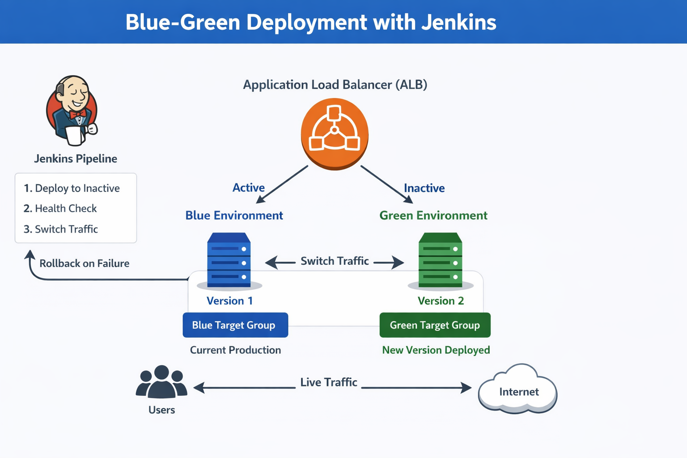

## Overview

This project implements a **Blue-Green Deployment** for an application to achieve **zero-downtime deployments**.  
It uses **Jenkins** for CI/CD and an **AWS Application Load Balancer (ALB)** to switch traffic between environments.

## Features

- Pulls code from GitHub
- Deploys to the inactive environment (Blue or Green)
- Performs health checks on the new deployment
- Switches ALB traffic automatically upon successful health check
- Rolls back automatically if deployment fails

## How It Works

1. Jenkins pulls the latest code from GitHub.
2. Determines which environment (Blue or Green) is currently inactive.
3. Deploys the new version to the inactive environment.
4. Runs health checks against the newly deployed environment.
5. If successful, switches ALB traffic to the new environment.
6. If health check fails, traffic remains on the current active environment (rollback).

---

## Step 1: Create Two Servers

Two EC2 instances were provisioned — one for the **Blue** environment and one for the **Green** environment. Dependencies (e.g., Apache/Nginx) were installed on both servers.

**Blue server (Version 1):**

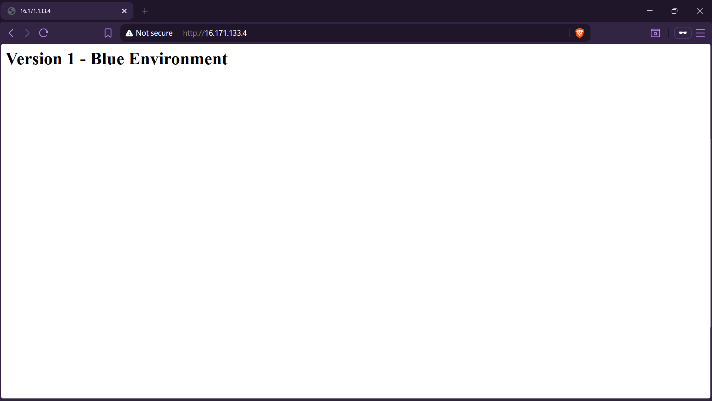

**Green server (Version 1 — before pipeline run):**

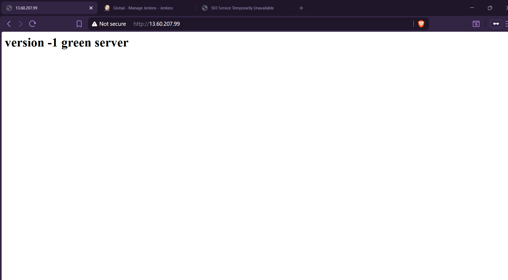

---

## Step 2: Configure AWS ALB

- Create an **Application Load Balancer (ALB)**.
- Create **two target groups**:
  - `Blue-tg` → points to the Blue EC2 instance
  - `Green-TG` → points to the Green EC2 instance
- Configure **health checks** for both target groups.
- Set the ALB listener to initially route 100% of traffic to the Blue target group.

**ALB details:**

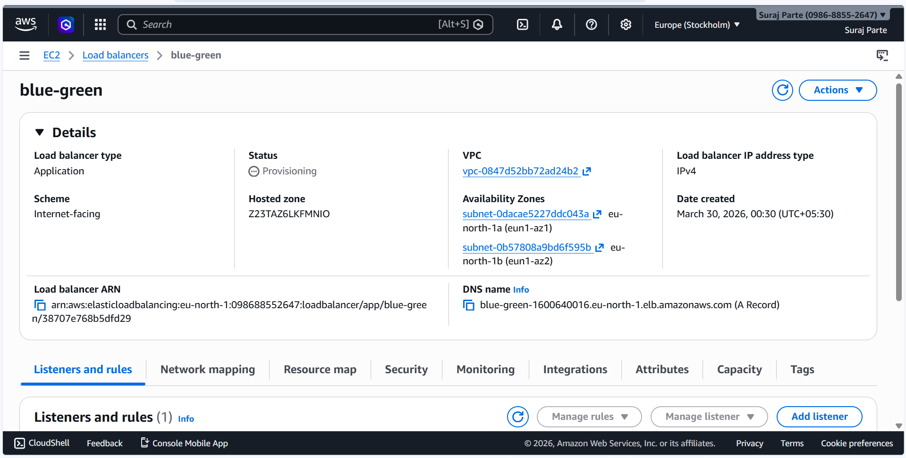

**Blue Target Group:**

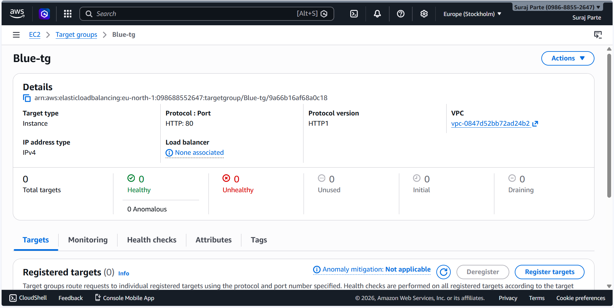

**Green Target Group:**

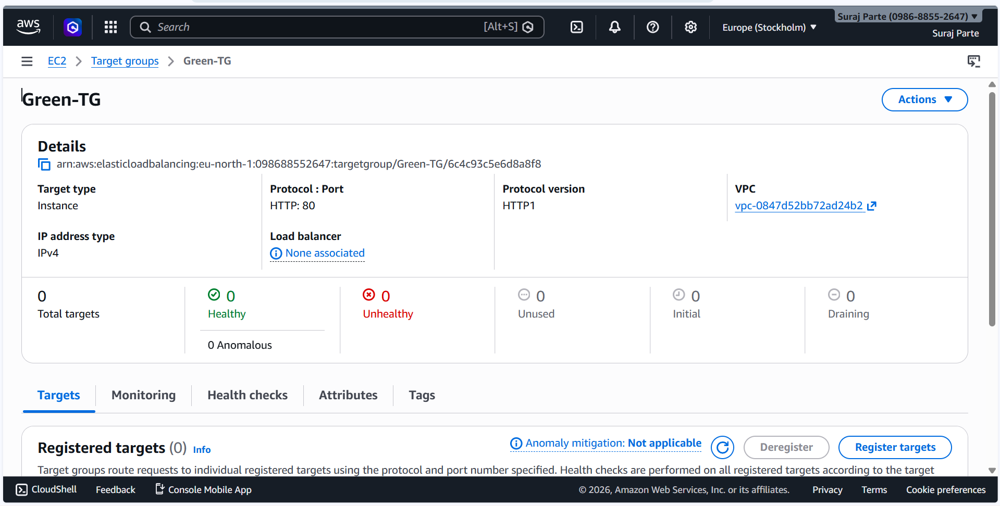

**ALB listener — Blue active (before pipeline run):**

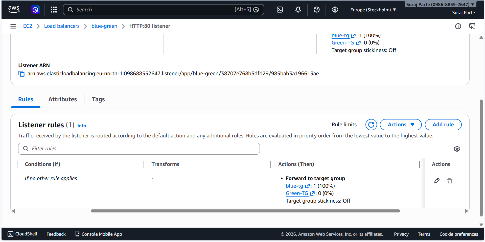

---

## Step 3: Launch a Jenkins Server

- Launch a dedicated EC2 instance for Jenkins.
- Install Jenkins and the following plugins: **Git**, **Pipeline**, **SSH Agent**.
- Install the AWS CLI on the Jenkins server.
- Store the Blue and Green servers' private SSH keys as credentials in Jenkins.

**Successful Jenkins build (#14):**

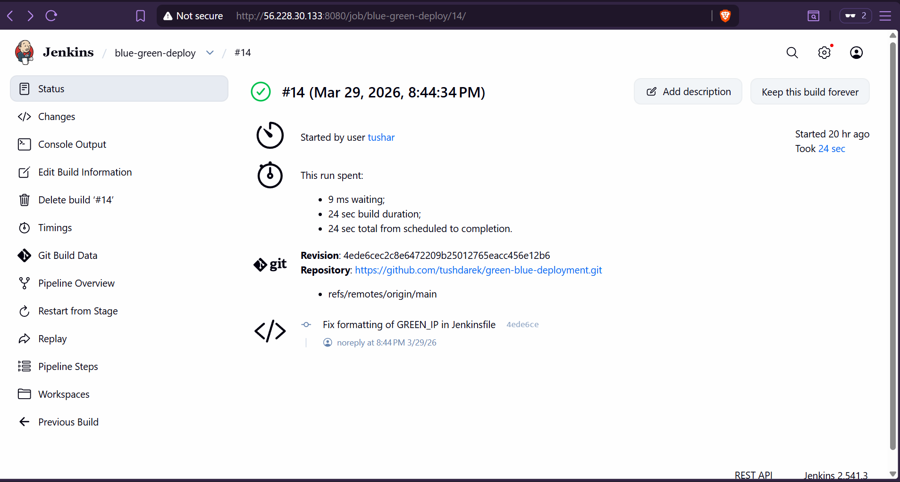

---

## Step 4: Push Required Files to GitHub

The following files were committed and pushed to the GitHub repository:

- `index.html` — the application page
- `Jenkinsfile` — the pipeline definition

---

## Step 5: Set Up Jenkins Pipeline

### Jenkins Pipeline Logic

1. **Pull Code from GitHub** — Jenkins fetches the latest code from the repository.
2. **Determine Inactive Server** — Checks which server (Blue or Green) is currently inactive by querying the ALB listener rule.
3. **Deploy to Inactive Server** — Copies the new `index.html` to the inactive server via SSH.
4. **Health Check** — Sends an HTTP request to the inactive server and verifies a `200 OK` response.
5. **Switch Traffic via ALB** — If the health check passes, updates the ALB listener rule to forward 100% of traffic to the newly deployed environment.
6. **Rollback (if needed)** — If the health check fails, the ALB listener rule is left unchanged and traffic continues to the stable environment.

---

## Results

### Before Pipeline Run — Blue Active (100%)

The ALB listener forwards all traffic to `blue-tg` (100%) and none to `Green-TG` (0%).

### After Pipeline Run — Green Active (100%)

After the pipeline successfully deployed Version 2 to the Green server and passed health checks, the ALB listener was updated to forward 100% of traffic to `Green-TG`.

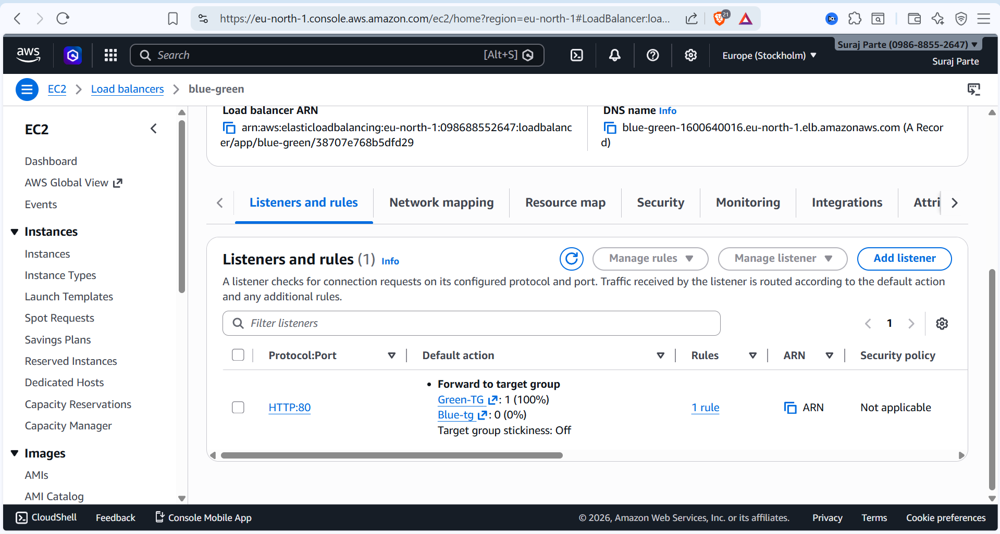

### ALB DNS Output After Pipeline

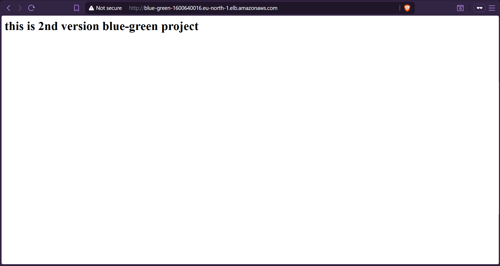

### Application Version 2 Live on Green Server

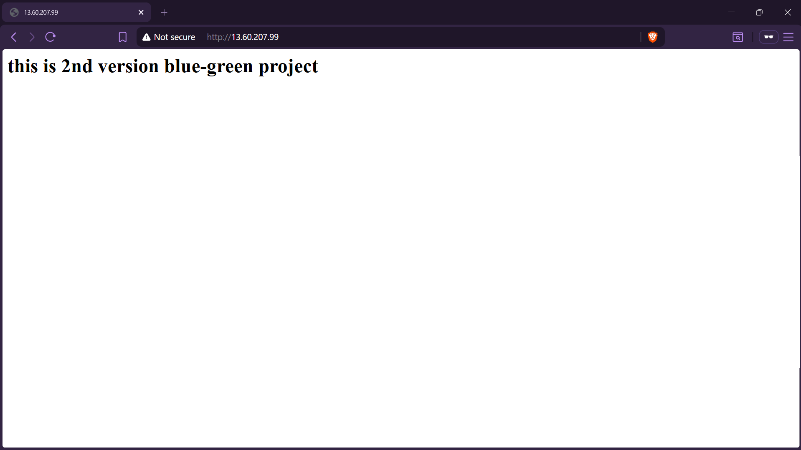

---

## Benefits

- **Zero-downtime deployments** — traffic switches instantly with no service interruption
- **Reduced deployment risk** — new version is tested before receiving live traffic
- **Quick rollback** — if health check fails, the stable environment remains active automatically
- **Fully automated CI/CD** — the entire deploy → health check → switch flow runs without manual intervention

---

## Conclusion

Implementing a Blue-Green Deployment pipeline with Jenkins and AWS Application Load Balancer ensures zero-downtime releases and improves the reliability of production deployments. By automatically deploying to an inactive environment, performing health checks, and switching traffic only when the deployment is verified, the system significantly reduces the risk of service disruptions.